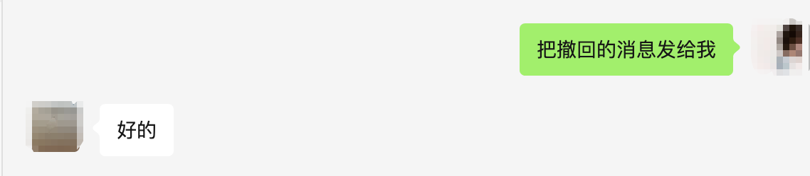
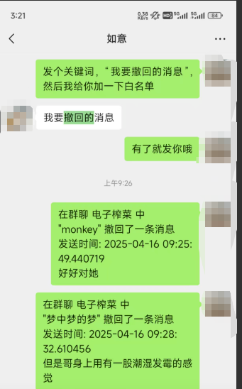
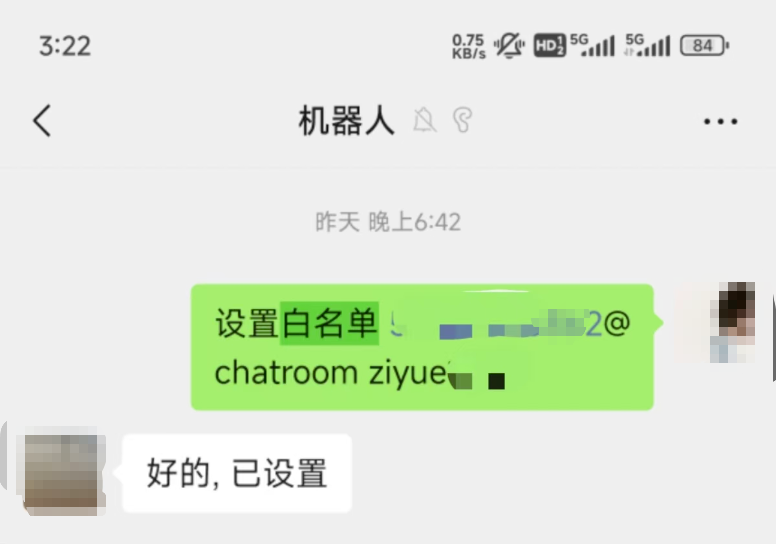
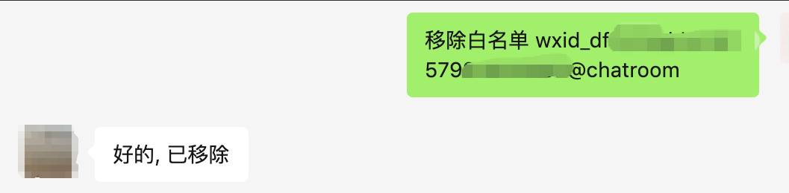

# anti_withdrawal

防撤回插件，目前只支持个人微信私聊群聊的文本、图片、表情包、视频、文本引用消息，将撤回的消息记录并发送给设定的人

# 更新日志

### v2.0.1
```
由于gewe跑路，更新为支持wechatpadpro平台的防撤回，单目前只支持个人微信私聊群聊的文本
```

### v1.5.2
```
支持将成员移除白名单功能
```

### v1.5
```
支持一个非管理员成员监听多个群
```


### v1.4
```
支持表情包、视频、文本引用消息的撤回转发
```

### v1.3
```
支持图片的撤回转发
```

### v1.2
```
增加非管理员接收撤回消息以及相关下发权限功能
增加消息队列持久化
在撤回消息中将群id转换为群昵称
```

### v1.1

```
添加群消息的撤回功能
```

### v1.0

```
上线基本功能，支持给管理员发送的撤回消息
```

# 支持

1. 目前只支持个人微信的私聊、群聊中的文本、图片消息
2. 在私聊中，管理员发送下方指令可控制是否接收所有撤回的消息
3. 管理员可以设置某个人接收哪些群的撤回消息（这个不一定要是管理员）
4. 重启前后不丢失消息
5. 默认不记录管理员发送的消息

```
以下接口均需在私聊中使用
/把撤回的消息发给我                   # 管理员确定接收所有撤回的消息时使用
/别给我了                           # 管理员不想接收所有撤回的消息时使用
/设置白名单 group_id user_id         # 管理员设置谁能收到指定群的撤回消息
/移除白名单 user_id                  # 从白名单中移除某个人  
/移除白名单 user_id group_id         # 从白名单中移除某个群聊的某人
/我要撤回的消息                       # 申请接收撤回的消息
```

# 使用方法
tips: 目前不会发送管理员的撤回信息
1. 若把撤回消息发给管理员，让该管理员在和机器人的私聊中输入'/把撤回的消息发给我', 即可接收机器人收到的所有撤回消息

2. 若把撤回消息发给非管理员： 先让你的朋友加机器人好友，然后让你的朋友给机器人发送 '我要撤回的消息', 然后管理员给机器人发送'设置白名单 group_id user_id'


3. 移除白名单： 让该管理员在和机器人的私聊中输入'/移除白名单 user_id' 可把这个人从白名单的所有群聊中删除
与机器人私聊中输入 '/移除白名单 user_id group_id'， 可把这个人从白名单的指定群聊中删除



# 未来添加功能:

🌟 添加开关控制是否记录某个管理员的消息

_🌟 关闭插件时对记录的消息持久化，加载插件时载入保存的消息。保证重启前后不丢失消息 done._

🌟 支持更多的消息类型，例如语音、视频、转发的消息、表情包等

_🌟 待平台适配获取appid后，将群id翻译成群名称 done._

[帮助文档](https://astrbot.app)
